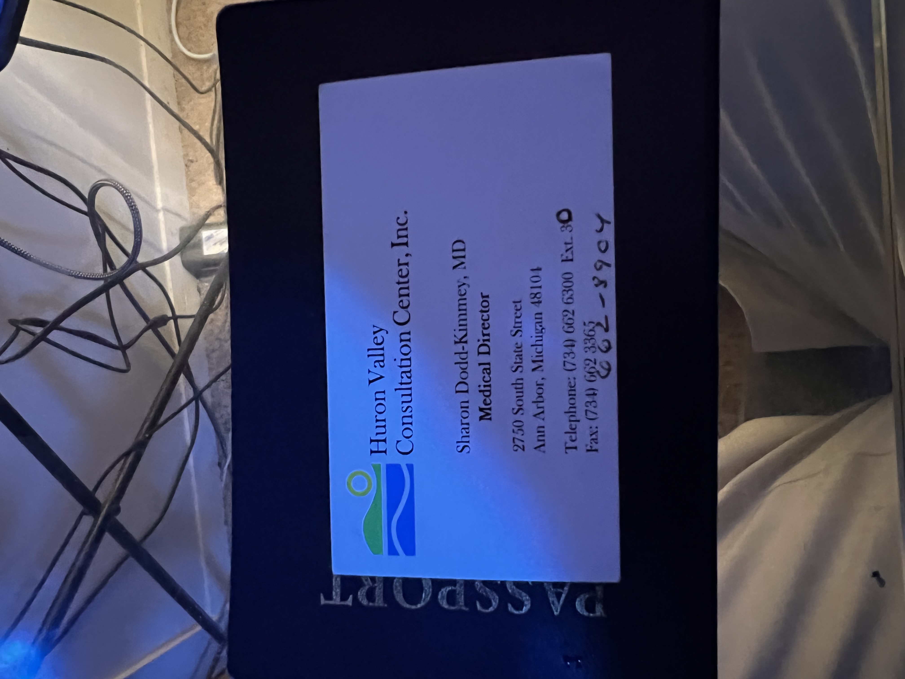
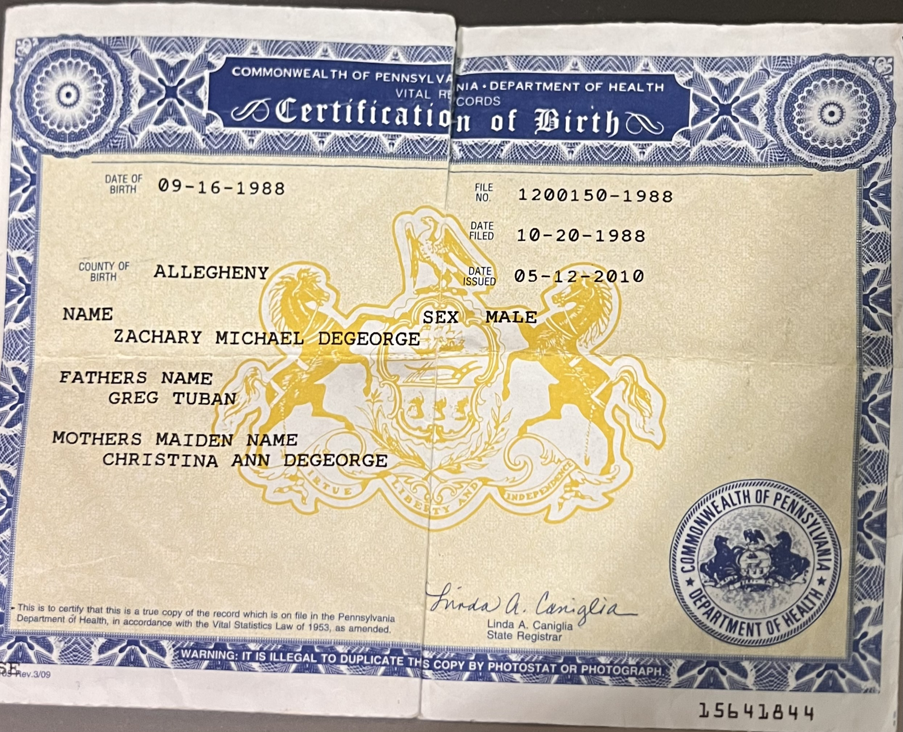
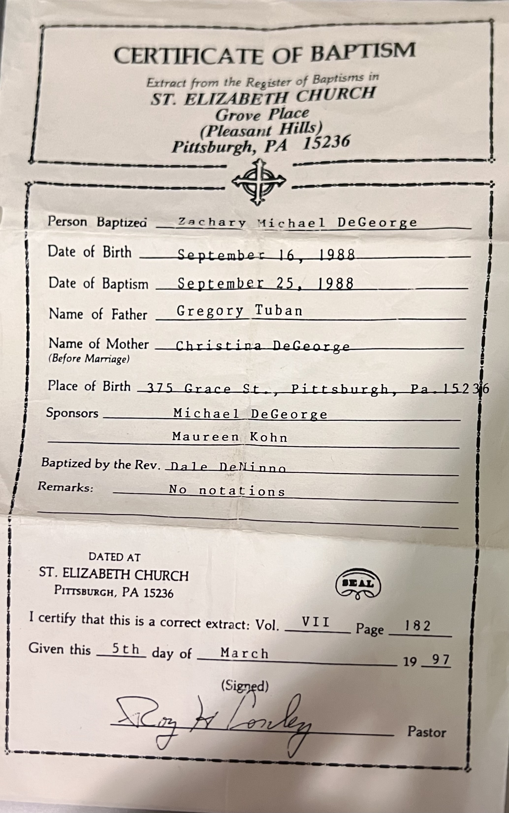

<!-- @format -->

Please help me, I have found myself in a situation with many questions and no authority to go take them to.

I pulled a manic stunt on February 17, 2019 in Ann Arbor, MI where I was picked up on what I have been told was a no-knock warrant and where the AAPD sent a literal fleet on me, and I didn't even realize it until recently but I don't even remember going to the local hospital or being booked at the city or county jail, I just remember waking up on a stretcher at the Pontiac General Hospistal, which is a psych ward on the 3rd floor of an old empty hospital in Pontiac, Michigan 2 counties away from Ann Arbor to a plate of the best meat loaf I have ever had (I don't eat meat loaf very often). I don't know what the cause of this blackout was, which leaves me only to my suspicions, and which are not good for people with a diagnosed disorder like me (Bipolar I w/ Psychotic Features). I do not have the propensity for blackouts during my "episodes", but at this hospital is where I met "Amanda Giovanni", although I have told many people that I met her while I was working as a Senior SW Engineer at Bosch when she was supposedly working for Siemens in 2015, under her advisement. While in the hospital Giovanni talked up her knowledge on the F-22, 25, and 35 jets, about how the F-35's aparently have a pretty nasty overheating problem, and even showed me a bullet wound in her stomach from some time she spent in Iraq. She had a GPS tether on her ankle at the time, and I do remember a female blonde US Marshal coming to remove it during our stay, which made her really happy and proclaim excitedly that "This was going to pay for her flat in Paris". She made sure to connect with me before we seperated, because I was discharged before she was, and we connected through LinkedIn [See Here](https://www.linkedin.com/in/amandakgiovanni). At the time I just continued on my manic journey, but she popped back into play when she reached out to me I remember, and then proceeded to to stop in on me throughout my multiple incarcerations and hospital petitions that transpired this episode. She proceeded to send me food, bail me out of jail a few times, and talk up her work with the government as a private contractor through her company BIDS, while apparently her father died somehow, and that she blames on her family, and I learned that a rogue group of actors in the FBI and other government agencies were trying to track her down between West Bloomefield, where she grew up, and New York City, where her old boyfriend "Doug" is who apparently is a near billionaire with a double penthouse at 740 Park Avenue and is a partner at DLI Piper International Law Firm handling a lot of middle eastern accounts lives and shelters her.

Does this this sound hard to believe? Because I am just getting started.

From roughly June 2019 - November 2020 I am incarcerated in jail and eventually end up in the Center for Forensic Psychiatry in Michigan on an NGRI plea, but I spend almost every day on the phone for at least an hour talking to Amanda. We talked about the companies we were going to build, the plans we had, and slowly I get to learn more details about what was going on with her and the FBI. After getting out in November of 2020, and going through the next year with her her, finally in May of 2022, after witnessing some pretty unethical behavior that included her using some contact she had somewhere in the government to defraud small businness COVID stimulus loans, which thank god my company was ineligable based on the fact that it wasn't incorporated until after COVID, I was able to get her in front of a nurse practitioner at my old doctors office that reports directly to the head of the NGRI committee that I am overseen by, Dr. Sharon Dodd-Kimmey, and what I heard triggered me, although at the time I did not know exactly why. I have concluded that it was by the way she insinuated that her fingerprints had literally been burned off by the government for her job, and then after when I decided to write about what was going on in my head, something I had not done in over 15 years, I realized then that there was those 8 hours or so that I blacked out preceeding when I eventually met her, and that's when I started to get paranoid.

I have known for quite some time that Amanda is a professional liar, but she may not know that I am also a professional fool, and less than a day after her teaching me about "playbooks" it wasn't hard for me to realize that she was running a playbook on me. Why would she be running a playbook on me? Specifically I do not know. I have probably the worst credit, a diagnosed psychiatric disorder, multiple compulsions, and at the time was over 325 pounds (thanks to her). I thought about this patent I have for a very cool magnet that I am 99% sure has a current curve of 1/t, but these thoughts all seemed delusional and were supported by thoughts of references that were triggered after I recieved a death threat on May 24, 2022 after a very busy work load. So I have been trying to collect evidence to try and figure out who exactly this "Amanda Karmine Giovanni" is, as well as "Doug" her supposed boyfriend, and the evidence seems to point to a striaght up con. Why me? That I can not conclude. I can think of a ton a more suitable targets, but this was a long con, because it has been going on since 2019.

Here is her exact story, as many details as I could remember (missing most of the pronouns), based on 2 stories; 1 told privately in a car ride and another to the nurse practitioner at the doctors meeting:

Apparently, in Kurdistan, Northern Iraq in 2015, 2 friends, FBI Agents Kuntz & somebody, of FBI Special Agent Lawrence Borghini approached Amanda to smuggle cash that was made by selling stolen US weapons on the black market through the Miami Airport, in this particular case the MANPADS from the US Embassy in Bengazi. She was approached because she had a diplomatic passport at the time, meaning she did not need to go through customs. According to Amanda, it was these weapons, or the lack-there-of, that directly led to the disaster at the Bengazi Embassy, and these agents she later learned were affiliated with Admiral Miller and DeLorean, the later of who is is currently in prison for illegal gun smuggling. She said the money was paid by the brother of one of the presidents of the 4 political factions of the Kurds, who at the time offered her a 25M watch, some brand that I was apparently supposed to have heard of, for her hand in marriage, both of which she denied, which is when she witnessed the transaction of cash between him and the FBI agents, in $500,000 duffel bags. After Amanda was approached to smuggle the money, in which there was to be multiple trips and where she would be allowed to keep 1 or 2 of the duffel bags for herself afterward, Amanda told me she reported the incident to the state department portal, but apparently that portal was being watched and the report never made it to the intended parties. So, still in Kurdistan, on her super secret mission to convince the Kurds to allow the US to build their base where the US wanted to (in the middle where all the resources were), she decided to take a walk by herself on a nice occassion and leave her security detail, and this is where she was eventually kidnapped and taken to an FBI black-ops site in some hole in the ground in Kurdistan, and tortured for the next 6 months, but while the agents torturing her proceeding to spill the beans about the whole opporation involving Admiral Michael H. Miller, whom she says left the military in 2015 with 120M stuffed in his pockets, and whom she says she was requested and eventually worked on some process for covering up his discharge under the direct request of John McCain, who later wrote two letters of apology to her mother, who she despises, but those letters are now sealed. Yea...

Somehow she gets out of the hole in the ground and ends up at an overseas base, where they make her wait to heal physically before brining her back to the states. There she sees a govt shrink where they start her on ptsd meds that would allow her to keep her security clearance, and she gets council to sue the government, but the rougue FBI agents apparently aren't done with her, and a team of 20 agents from Panama City, FL lead a raid on her Alexandria home where they didn't follow any protocol in terms of informing their office or the home office in DC of their raid. This raid is led by FBI Special Agent Lawrence Borghini. Apparently when they raided her home there already was 2 other FBI agents with her, but that is the only mention of them in her story. The agents proceed to take anything and everything of value / interest from her home, and apparently even try and force her to access the portal in her home that has access to all the NSA secret apps like pearls, and scattered castles, and prism, but didn't realize there was a heartbeat sensor on the machine that was preventing them from gaining access. They drag Amanda to the Virginia Detention Center, where they lock her up in Block B where the Guantanamo Bay people stay, and when she eventually gets in front of a judge Borghini doesn't have any evidence or charges, so when the judge is about to order Amanda released he says she has co-conspirators and is a flight risk, and eventually convices the judge to hold Amanda without charges by naming 2 people including someone that was the current head of the FT(something, lives in Colorado). Borghini then proceeds to fly her from federal detention center to center, keeping her from being able to be located by her lawyers and from getting in front of a judge, until her father and boyfriend (Presumedly Doug Mikha, but possibly a complete lie), literally call the Pope, and by his holy intervention she ends up at the Panama City County Jail where the judge is currently vacant due to corruption allegations (apparently you can just resign before you get fired and then get reassigned elsewhere). Here is where she starts to have medications used against her, being dosed with serequel at levels of 900mg, to prevent her from being able to participate in her defense, but eventually she is able to get a hold of one of her estate lawyers Howard Birmiel, and eventually she is allowed to start working on her legal case where I remember her bragging of having her own room and literally hiring some of the other girls as her assistants.

She eventually get's bailed out of the Panama City Jail, and uses the fact that her mother got diagnosed with Leukemia or some other kind of cancer to allow her to transfer to Michigan, but she is ordered to be gps-tethered and to see a doctor through the court as part of the condition for this transfer. This doctor proceeds to drug her with what what would eventually become a whole trashbag full of various medications that I have never even heard of, including 900mg of serequel multiple times a day. Eventually, when the FBI team led by Borghini can't produce any witnesses for their charges, which I think were something crazy like being a state sponsored assasin with over 400 kills, the judge announces he is going to dismiss the case and that the FBI has to return the over $1B of assets that were confiscated from her residences and company BIDS, with prejudice, which is apparently a very big deal. But a couple of days before the hearing that is to make the dismissal official Amanda is called in by the doctor from the court for a medication refill, to the Common Ground Resource & Crisis Center, where she is physhically apprehended by chaining her to a pole and then a fake psychiatriac petition is made up that apparently was never signed by a judge by Borghini and she ends up at Pontiac General Hospital, where she someonehow runs into me.

What am I supposed to believe?

Before I wrote this I had 3 possible scenarios:

1. What she says is true
2. She is just con-artist with a very elaborate back-story
3. She running a playbook on me for the government

This bitch literally claims to have her fingerprints burned off. And I met her directly after I pulled a rediculous stunt that I'm pretty sure I was intentionally knocked out via injectable drugs and shipped to a psych ward on the 3rd floor of an empty hospital... all of which sound suspicious. The local police, AAPD, literally are complicit and don't give a damn, as well as the FBI, which I know because I have gone to both of them and recieved a figurative "go fuck yourself" from both.

I just want to know the truth about the current situation and my identity, the lack of both which have led me to some very paranoid and unpredicatable behavior starting in 2006.

Can you please help me? I am not a threat, I am just confused.

- Zachary Michael DeGeorge
- September 16, 1988
- Pittsburgh, PA - Allegheny County

- Mother: Christina Ann DeGeorge
- September 3, 1965
- Pittsburgh, PA - Allegheny County

- Father: Greg/Gregory Tuban (According to most recent birth certificut)
- Birthdate: ?
- ?

My birth certificate was issued in 2010 with the fathers name "Greg Tuban", after I was 18, but I know I didn't request it and I know I have have seen a copy of it without my fathers name included.

My Baptismal certificate was issued in 1997 w/ the fathers name "Gregory Tuban". I would have been 8 at the time.

They apparently met in the PA Program at Alderson Broaddus University, a self-proclaimed American Baptist Church USA affiliated university despite my families strong Catholic background.

Please help me. Something is amiss.
